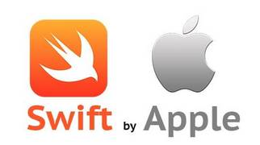

## swift-app-lessons

# Разработка приложения на основе языка Swift. 

## Уроки 1,2: Знакомство с приложением
### Описание
- Создание проекта
- Жизненный цикл приложения
    - Методы AppDelegate
- UIViewController
    - Жизненный цикл контроллера
    - Создание нового контроллера
    - Переход между контроллерами
    - present
    - addChild
    - viewWillDisappear и viewDidDisappear
- Добавление элементов на экран
    - frame и bounds
    - Добавление элементов
- Auto Layout
- UITabBarController и UINavigationController
    - UITabBarController
    - UINavigationController
- UIButton
    - Responder Chain
- Storyboard

[lesson 1](sw-1/README.md)

## Урок 3,4: Разработка интерфейса
### Описание
- UIScrollView
- UITableView
    - UITableViewDataSource
    - UITableViewDelegate
    - IndexPath
    - automaticDimension
    - contentView
    - Кастомные ячейки
    - Переиспользование ячеек
    - UITableViewController
- UICollectionView
    - UICollectionViewDataSource
    - Кастомная ячейка
    - Добавление ячейки
    - UICollectionViewDelegate
    - UICollectionViewController
    - UICollectionViewCompositionalLayout
    - UICollectionViewDiffableDataSource
- UIStackView

[lesson 2](sw-2/work-2v2/README.md)

## Урок 5,6: Работа с сетью
### Описание
- Работа с сетью
    - URL
    - HTTP Request
- URLSession
- Маппинг json
    - Codable
    - Decodable и Encodable
    - CodingKeys
- try-do-catch
- JSONDecoder
- Post
- Alamofire
    - CocoaPods
    - get
    - post
- AppTransportSecurit

[lesson 3](sw-3/work-32/README.md)

## Урок 7,8: Многопоточность
### Описание
- Делегирование
- Grand Central Dispatch
    - Потоки
    - Очереди
    - serial
    - concurrent
    - sync и async
- Operation
    - Жизненный цикл операции
- async/await
- Проблемы многопоточности
    - Состояние гонки
    - Голодание
    - Активная блокировка
    - Взаимная блокировка
    - Инверсия приоритетов
    - Гонка за данными

[lesson 4](sw-4/README.md)

## Урок 9,10: Анимация
### Описание
- Анимации
    - Базовые анимации
    - Анимации с задержкой
    - Completion
    - Options
    - Пружинная анимация
    - Transition
    - CALayer
    - CABasicAnimation
    - CAKeyframeAnimation
    - CATransition
    - fillMode
    - CAAnimationGroup
    - UIViewPropertyAnimator
    - UITouch
- SwiftUI
    - @State
    - @ObservedObject
    - @Binding
    - Другие обёртки
    - Навигация между экранами
    - NavigationStack

[lesson 5](sw-5/README.md)

## Урок 11,12: Хранение данных
### Описание
- Хранение данных
    - Core Data
    - Relationships
    - NSFetchedResultsController
    - Keychain
    - UserDefaults
- Паттерны
    - Декоратор
    - Абстрактная фабрика
    - Одиночка
- Уведомления

[lesson 6](sw-6/README.md)

## Урок 13,14: Архитектуры и тестирование
### Описание
- Какие бывают архитектурные паттерны
- Что такое SOLID, KISS, DRY и YAGNI
- Зачем нужен SwiftLint
- Несколько правил хорошего кода
- Что такое unit и ui-тесты

[lesson 7](sw-7/README.md)

    