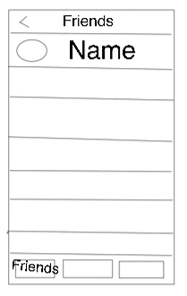
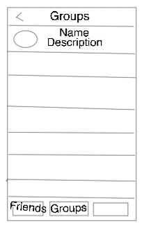
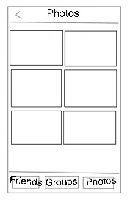

[Переход на Главную страницу](../README.md)
<hr><hr>

# Разработка приложения на основе языка Swift.
## Урок 3 и 4: Разработка интерфейса
### Описание
- UIScrollView
- UITableView
    - UITableViewDataSource
    - UITableViewDelegate
    - IndexPath
    - automaticDimension
    - contentView
    - Кастомные ячейки
    - Переиспользование ячеек
    - UITableViewController
- UICollectionView
    - UICollectionViewDataSource
    - Кастомная ячейка
    - Добавление ячейки
    - UICollectionViewDelegate
    - UICollectionViewController
    - UICollectionViewCompositionalLayout
    - UICollectionViewDiffableDataSource
- UIStackView

<br>
<hr><hr>

## Тема: Разработка интерфейса (Swift, без Storyboard)
## Задание:
#### 1. Добавление нового экрана в проект без storyboard:

В проект без сториборда добавить новый экран. На экране должно отображаться 5 ячеек. Раздел всего один. Ячейка должна соответствовать схеме

- Экран должен быть `UITableViewController`.
- Отображение: 5 ячеек.
- Раздел - один.
- Ячейка должна быть приближена к представленной схеме.

##### Схемы экранов:
- Первый экран:

  

- Второй экран:

  

- Третий экран:

  


#### 2. Обработка кнопки "Войти":
- При нажатии должно происходить переключение к контроллеру из пункта 1.

#### 3. Реакция на нажатие ячейки:

По клику на ячейку из пункта 1 должен быть переход на экран, напоминающий экран переписки. Экран должен быть приближен к схеме.

- Должен происходить переход на экран, напоминающий переписку.
- Макет должен быть приближен к схеме из файла.

##

## Дополнительные условия:
### 1. UITabBarController:
- Новый экран должен быть `UITabBarController` без использования storyboard.
- Он содержит **три вкладки**:
    - Friends
    - Groups
    - Photos

- Переключение между вкладками должно работать.

#### Контент экранов:
- **Friends** и **Groups**:
    - По 5 ячеек на каждом экране.
    - Использовать **кастомные ячейки**.

- **Photos**:
    - 6 изображений на экране.

- Все экраны должны быть **приближены к схеме**.

### 2. Поведение кнопки "Войти":
- При нажатии кнопки "Войти" должно происходить переключение к `UITabBarController`.

##
## Ожидаемый результат:

| № | Описание                                                                                                                          |
|---|-----------------------------------------------------------------------------------------------------------------------------------|
| 1 | Реализован `UITabBarController` с тремя экранами, приближёнными к схеме. На первых двух - по 5 ячеек. На третьем - 6 изображений. |
| 2 | По нажатию на кнопку "Войти" осуществляется переход к контроллеру из пункта 1.                                                    |

<br>
<hr><hr>

## Решение задания
# Инструкция для интерфейса без Storyboard
##
## Краткое содержание

**Цель:** реализовать несколько экранов iOS-приложения без использования Storyboard, с применением `UITableViewController`, `UITabBarController`, кастомных ячеек, `UICollectionView`.

**Основные задачи:**

1. Создание экрана на `UITableViewController` без storyboard.
2. Обработка кнопки "Войти" - переход на экран с таб-баром.
3. Создание `UITabBarController` с тремя вкладками: Friends, Groups, Photos.
4. Кастомные ячейки для Friends и Groups.
5. Коллекция изображений для Photos.

##
## Шаги реализации
### 1. Новый экран с `UITableViewController`
#### Создание `LoginTableViewController`

```swift
import UIKit

class LoginTableViewController: UITableViewController {
    override func viewDidLoad() {
        super.viewDidLoad()
        tableView.register(CustomTableViewCell.self, forCellReuseIdentifier: "CustomCell")
    }

    override func numberOfSections(in tableView: UITableView) -> Int {
        return 1
    }

    override func tableView(_ tableView: UITableView, numberOfRowsInSection section: Int) -> Int {
        return 5
    }

    override func tableView(_ tableView: UITableView, cellForRowAt indexPath: IndexPath) -> UITableViewCell {
        let cell = tableView.dequeueReusableCell(withIdentifier: "CustomCell", for: indexPath) as! CustomTableViewCell
        cell.configure(with: "Ячейка \(indexPath.row + 1)")
        return cell
    }

    override func tableView(_ tableView: UITableView, didSelectRowAt indexPath: IndexPath) {
        let chatVC = ChatViewController()
        navigationController?.pushViewController(chatVC, animated: true)
    }
}
```

#### Кастомная ячейка

```swift
class CustomTableViewCell: UITableViewCell {
    private let label = UILabel()

    override init(style: UITableViewCell.CellStyle, reuseIdentifier: String?) {
        super.init(style: style, reuseIdentifier: reuseIdentifier)
        setupView()
    }

    required init?(coder: NSCoder) {
        fatalError("init(coder:) has not been implemented")
    }

    func setupView() {
        contentView.addSubview(label)
        label.translatesAutoresizingMaskIntoConstraints = false
        NSLayoutConstraint.activate([
            label.centerYAnchor.constraint(equalTo: contentView.centerYAnchor),
            label.leadingAnchor.constraint(equalTo: contentView.leadingAnchor, constant: 20)
        ])
    }

    func configure(with text: String) {
        label.text = text
    }
}
```

##
### 2. Кнопка "Войти"
#### Создание экрана входа с кнопкой

```swift
class LoginViewController: UIViewController {
    private let button: UIButton = {
        let button = UIButton(type: .system)
        button.setTitle("Войти", for: .normal)
        button.addTarget(self, action: #selector(goToTabBar), for: .touchUpInside)
        return button
    }()

    override func viewDidLoad() {
        super.viewDidLoad()
        view.backgroundColor = .white
        view.addSubview(button)
        button.translatesAutoresizingMaskIntoConstraints = false
        NSLayoutConstraint.activate([
            button.centerXAnchor.constraint(equalTo: view.centerXAnchor),
            button.centerYAnchor.constraint(equalTo: view.centerYAnchor)
        ])
    }

    @objc func goToTabBar() {
        let tabBarVC = MainTabBarController()
        navigationController?.pushViewController(tabBarVC, animated: true)
    }
}
```

##
### 3. TabBar с тремя вкладками

```swift
class MainTabBarController: UITabBarController {
    override func viewDidLoad() {
        super.viewDidLoad()

        let friendsVC = FriendsViewController()
        let groupsVC = GroupsViewController()
        let photosVC = PhotosViewController(collectionViewLayout: UICollectionViewFlowLayout())

        friendsVC.tabBarItem = UITabBarItem(title: "Friends", image: nil, selectedImage: nil)
        groupsVC.tabBarItem = UITabBarItem(title: "Groups", image: nil, selectedImage: nil)
        photosVC.tabBarItem = UITabBarItem(title: "Photos", image: nil, selectedImage: nil)

        viewControllers = [friendsVC, groupsVC, photosVC]
    }
}
```

##
### 4. Friends и Groups - TableView с кастомными ячейками

```swift
class FriendsViewController: UITableViewController {
    override func viewDidLoad() {
        super.viewDidLoad()
        tableView.register(CustomTableViewCell.self, forCellReuseIdentifier: "CustomCell")
    }

    override func tableView(_ tableView: UITableView, numberOfRowsInSection section: Int) -> Int {
        return 5
    }

    override func tableView(_ tableView: UITableView, cellForRowAt indexPath: IndexPath) -> UITableViewCell {
        let cell = tableView.dequeueReusableCell(withIdentifier: "CustomCell", for: indexPath) as! CustomTableViewCell
        cell.configure(with: "Friend \(indexPath.row + 1)")
        return cell
    }
}
```

Для `GroupsViewController` - аналогично.

##
### 5. Photos - Коллекция изображений

```swift
class PhotosViewController: UICollectionViewController {
    override func viewDidLoad() {
        super.viewDidLoad()
        collectionView.register(PhotoCell.self, forCellWithReuseIdentifier: "PhotoCell")
    }

    override func collectionView(_ collectionView: UICollectionView, numberOfItemsInSection section: Int) -> Int {
        return 6
    }

    override func collectionView(_ collectionView: UICollectionView, cellForItemAt indexPath: IndexPath) -> UICollectionViewCell {
        let cell = collectionView.dequeueReusableCell(withReuseIdentifier: "PhotoCell", for: indexPath) as! PhotoCell
        cell.imageView.image = UIImage(systemName: "photo")
        return cell
    }
}
```

#### Кастомная ячейка:

```swift
class PhotoCell: UICollectionViewCell {
    let imageView = UIImageView()

    override init(frame: CGRect) {
        super.init(frame: frame)
        contentView.addSubview(imageView)
        imageView.translatesAutoresizingMaskIntoConstraints = false
        NSLayoutConstraint.activate([
            imageView.topAnchor.constraint(equalTo: contentView.topAnchor),
            imageView.bottomAnchor.constraint(equalTo: contentView.bottomAnchor),
            imageView.leadingAnchor.constraint(equalTo: contentView.leadingAnchor),
            imageView.trailingAnchor.constraint(equalTo: contentView.trailingAnchor)
        ])
        imageView.contentMode = .scaleAspectFit
    }

    required init?(coder: NSCoder) {
        fatalError("init(coder:) has not been implemented")
    }
}
```

##
## Результат

| № | Описание                                        |
|---|-------------------------------------------------|
| 1 | На экране входа есть кнопка "Войти".            |
| 2 | При нажатии - переход на `UITabBarController`.  |
| 3 | Вкладки "Friends", "Groups", "Photos" работают. |
| 4 | В Friends и Groups по 5 кастомных ячеек.        |
| 5 | В Photos - 6 изображений.                       |
| 6 | Выбор ячейки открывает экран переписки.         |

##
## Инициализация в SceneDelegate

```swift
window = UIWindow(windowScene: windowScene)
window?.rootViewController = UINavigationController(rootViewController: LoginViewController())
window?.makeKeyAndVisible()
```

##

<br><br>

[Переход на Главную страницу](../README.md)
<hr><hr>