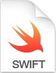

[Переход на Главную страницу](../README.md)
<hr><hr>

# Разработка приложения на основе языка Swift.
## Урок 5 и 6: Работа с сетью
### Описание
- Работа с сетью
    - URL
    - HTTP Request
- URLSession
- Маппинг json
    - Codable
    - Decodable и Encodable
    - CodingKeys
- try-do-catch
- JSONDecoder
- Post
- Alamofire
    - CocoaPods
    - get
    - post
- AppTransportSecurit

<br>
<hr><hr>

## Задание:
### 1. WKWebView - авторизация VK

Необходимо очистить ViewController и добавить на него WKWebView(WKWebView).
Для этого необходимо вверху импортировать WebKit,
затем добавить WKWebView в качестве subview и сделать контроллер делегатом для webView (для этого
ViewController должен соответствовать WKNavigationDelegate).

- Очистить `ViewController.swift`.
- Импортировать `WebKit`.
- Добавить `WKWebView` в качестве `subview`.
- Сделать контроллер делегатом `WKNavigationDelegate`.
- В `viewDidLoad()` настроить загрузку URL:

```swift
webView.load(URLRequest(url: url))
```
Вариант настройки:

```swift
private lazy var webView: wkWebView = {
    let webView = WKWebView() 
    webView.navigationDelegate = self 
    return webView
}()
```

Затем необходимо начать загрузку, например, во viewDidLoad().
Для этого вызывается webView.load и передается URLRequest.
Подробнее о запросе, который необходимо отправить можно прочитать в публикации 'oauth-parameters'


- Подробнее о параметрах запроса:
  https://dev.vk.com/api/oauth-parameters
- Пример использования `decidePolicyFor`:

```swift
func webView(_ webView: WKWebView, decidePolicyFor navigationResponse: 
WKNavigationResponse, decisionHandler: @escaping 
(WKNavigationResponsePolicy) -> Void) {
    // Обработка ответа авторизации
}
```

Пример:
```swift
func webView(_ webView: WKWebView, decidePolicyFor navigationResponse:
WKNavigationResponse, decisionHandler: @escaping
(WKNavigationResponsePolicy) -> Void) {
    guard let url = navigationResponse.response.url, url.path ==
"/blank.html", let fragment = url.fragment else {
        decisionHandler(.allow)
        return
    }
    let params = fragment
        .components(separatedBy: "&")
        .map { $0.components(separatedBy: "=") }
        .reduce([String: String]()) { result, param in
            var dict = result
            let key = param[0]
            let value = param[1]
            dict[key] = value
            return dict
    }
    let token = params["access_token"]
    let userID = params["user_id"]
    print(token)
    print(userID)
    decisionHandler(.cancel)
    webView.removeFromSuperview()
}
```

- Создать приложение на https://dev.vk.com/
- Документация WebKit: https://developer.apple.com/documentation/webkit/wkwebview

> Token и userID понадобятся для дальнейших запросов

##
### 2. Экран списка друзей

На следующем контроллере планируется отображение списка друзей.
Подумайте и решите, как удобнее: открывать окно авторизации на ViewController
и затем переходить к списку друзей или открывать авторизацию на экране списка друзей.
Реализуйте свое решение.

- После успешной авторизации должен быть переход к новому контроллеру.
- Реализовать один из подходов:
  - Авторизация на первом экране и переход к списку друзей.
  - Авторизация на экране списка друзей.
- Реализовать выбранное поведение.

##
### 3. Получение списка друзей

Получать список друзей. Для этого необходимо изучить документацию, а затем выбрать правильный метод.
Результат нужно выводить в консоль. Отображать список ненужно.
Место, где можно искать метод: https://dev.vk.com/method/friends.
Запрос должен отправляться только после перехода к экрану списка друзей

- Изучить метод `friends.get`: https://dev.vk.com/method/friends
- При открытии экрана списка друзей должен отправляться запрос.
- Выводить результат в консоль.

##
### 4. Получение списка групп

Получать список групп. Для этого необходимо изучить документацию, а затем выбрать правильный метод.
Результат нужно выводить в консоль. Отображать список ненужно.
Место, где можно искать метод: https://dev.vk.com/method/groups.
Запрос должен отправляться только после перехода к экрану списка групп

- Изучить метод `groups.get`: https://dev.vk.com/method/groups
- При открытии экрана списка групп должен отправляться запрос.
- Выводить результат в консоль.

##
### 5. Получение фотографий

Получать фотографии со страницы пользователя.
Для этого необходимо изучить документацию, а затем выбрать правильный метод.
Результат нужно выводить в консоль. Отображать фотографии не нужно. Место, где можно искать метод:
https://dev.vk.com/method/photos.
Запрос должен отправляться только после перехода к экрану фотографий

- Изучить метод `photos.getAll`: https://dev.vk.com/method/photos
- При открытии экрана списка фотографий должен отправляться запрос.
- Выводить результат в консоль.

##
## Ожидаемый результат

| № | Описание                                                                                                                         | Метод                                                    |
|---|----------------------------------------------------------------------------------------------------------------------------------|----------------------------------------------------------|
| 1 | На экране отображается `WKWebView`. Авторизация работает и можно зарегистрироваться.                                             | -                                                        |
| 2 | После авторизации реализован переход к следующему экрану. Студент реализовал свое решение.                                       | -                                                        |
| 3 | При открытии экрана друзей - запрос и вывод в консоль. Запрос должен отправляться только после перехода к списку друзей.         | Метод: например, https://dev.vk.com/method/friends.get   |
| 4 | При открытии экрана групп - запрос и вывод в консоль.Запрос должен отправляться только после перехода к списку групп.            | Метод: например, https://dev.vk.com/method/groups        |
| 5 | При открытии экрана фотографий - запрос и вывод в консоль. Запрос должен отправляться только после перехода к списку фотографий. | Метод: например, https://dev.vk.com/method/photos.getAll |

##
## Ссылки

- [OAuth параметры VK - https://dev.vk.com/api/oauth-parameters](https://dev.vk.com/api/oauth-parameters)
- [Создание приложения VK - https://dev.vk.com/](https://dev.vk.com/)
- [VK API Friends - https://dev.vk.com/method/friends.get](https://dev.vk.com/method/friends.get)
- [VK API Groups - https://dev.vk.com/method/groups](https://dev.vk.com/method/groups)
- [VK API Photos - https://dev.vk.com/method/photos.getAll](https://dev.vk.com/method/photos.getAll)
- [Документация WebKit - https://developer.apple.com/documentation/webkit/wkwebview](https://developer.apple.com/documentation/webkit/wkwebview)


<br>
<hr><hr>

## Решение задания
# Инструкция по заданию
## Краткое содержание задания

В этом задании необходимо реализовать авторизацию пользователя ВКонтакте с помощью `WKWebView`, 
получить токен доступа, и на основе этого токена - выполнить запросы к API VK 
для получения списка друзей, групп и фотографий. 
Работа осуществляется в среде iOS-приложения XCode с использованием языка Swift, фреймворка WebKit и сетевых функций.

##
## 1. Реализация авторизации через `WKWebView`
### Шаги:

1. Открыть `ViewController.swift`.
2. Очистить содержимое файла, оставив только объявление класса.
3. Импортировать WebKit:
   ```swift
   import WebKit
   ```

4. Создать свойство `WKWebView` и настроить делегат:
   ```swift
   private lazy var webView: WKWebView = {
       let webView = WKWebView()
       webView.navigationDelegate = self
       return webView
   }()
   ```

5. В `viewDidLoad()`:
  - Добавить `webView` на экран как `subview`.
  - Настроить `frame` или `Auto Layout`.
  - Задать `URLRequest` для авторизации ВКонтакте:

   ```swift
   override func viewDidLoad() {
       super.viewDidLoad()
       view.addSubview(webView)
       webView.frame = view.bounds

       let urlString = "https://oauth.vk.com/authorize?client_id=ВАШ_ID&display=mobile&redirect_uri=https://oauth.vk.com/blank.html&scope=friends,groups,photos&response_type=token&v=5.131"
       let url = URL(string: urlString)!
       let request = URLRequest(url: url)
       webView.load(request)
   }
   ```

6. Сделать класс `ViewController` соответствующим `WKNavigationDelegate` и реализовать метод `decidePolicyFor`:

   ```swift
   extension ViewController: WKNavigationDelegate {
       func webView(_ webView: WKWebView, decidePolicyFor navigationResponse: WKNavigationResponse, decisionHandler: @escaping (WKNavigationResponsePolicy) -> Void) {
           guard let url = navigationResponse.response.url,
                 url.path == "/blank.html",
                 let fragment = url.fragment else {
               decisionHandler(.allow)
               return
           }

           let params = fragment
               .components(separatedBy: "&")
               .map { $0.components(separatedBy: "=") }
               .reduce([String: String]()) { result, param in
                   var dict = result
                   let key = param[0]
                   let value = param[1]
                   dict[key] = value
                   return dict
               }

           let token = params["access_token"]
           let userID = params["user_id"]

           print("Access Token: \(token ?? "")")
           print("User ID: \(userID ?? "")")

           decisionHandler(.cancel)
           webView.removeFromSuperview()

           // Переход к следующему экрану
           let friendsVC = FriendsViewController()
           friendsVC.token = token
           navigationController?.pushViewController(friendsVC, animated: true)
       }
   }
   ```

##
## 2. Переход на экран списка друзей

- Создать новый контроллер `FriendsViewController`.
- Объявить свойство для хранения токена доступа:
   ```swift
   var token: String?
   ```

- В `viewDidLoad()`:
  - Использовать полученный токен.
  - Сформировать `URLRequest` и выполнить сетевой запрос с помощью `URLSession`.

##
## 3. Получение списка друзей

- Использовать метод [friends.get - https://dev.vk.com/method/friends.get](https://dev.vk.com/method/friends.get).
- Пример запроса:

```swift
let urlString = "https://api.vk.com/method/friends.get?access_token=\(token)&v=5.131"
let url = URL(string: urlString)!
let task = URLSession.shared.dataTask(with: url) { data, response, error in
    if let data = data {
        print(String(data: data, encoding: .utf8) ?? "")
    }
}
task.resume()
```

##
## 4. Получение списка групп

- Использовать метод [groups.get - https://dev.vk.com/method/groups.get](https://dev.vk.com/method/groups.get).
- Код аналогичен получению друзей, меняется только URL запроса:

```swift
let urlString = "https://api.vk.com/method/groups.get?access_token=\(token)&v=5.131"
```

##
## 5. Получение фотографий

- Использовать метод [photos.getAll - https://dev.vk.com/method/photos.getAll](https://dev.vk.com/method/photos.getAll).
- Пример запроса:

```swift
let urlString = "https://api.vk.com/method/photos.getAll?access_token=\(token)&v=5.131"
```

##
## Результат

| № | Описание                                                                | Метод           |
|---|-------------------------------------------------------------------------|-----------------|
| 1 | На экране отображается `WKWebView`. Авторизация работает.               | -               |
| 2 | После авторизации - переход к экрану списка друзей.                     | -               |
| 3 | При открытии экрана друзей - запрос к API и вывод результата в консоль. | `friends.get`   |
| 4 | При открытии экрана групп - запрос и вывод в консоль.                   | `groups.get`    |
| 5 | При открытии экрана фотографий - запрос и вывод в консоль.              | `photos.getAll` |

##
## Ссылки

- [OAuth параметры VK: https://dev.vk.com/api/oauth-parameters](https://dev.vk.com/api/oauth-parameters)
- [Создание приложения VK: https://dev.vk.com/](https://dev.vk.com/)
- [VK API Friends: https://dev.vk.com/method/friends.get](https://dev.vk.com/method/friends.get)
- [VK API Groups: (https://dev.vk.com/method/groups](https://dev.vk.com/method/groups)
- [VK API Photos: https://dev.vk.com/method/photos.getAll](https://dev.vk.com/method/photos.getAll)
- [Документация WebKit: https://developer.apple.com/documentation/webkit/wkwebview](https://developer.apple.com/documentation/webkit/wkwebview)

##


<br><br>

[Переход на Главную страницу](../README.md)
<hr><hr>